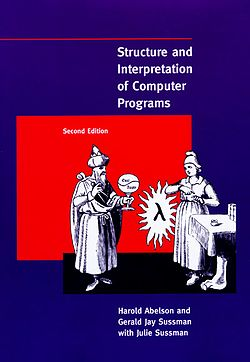

# "Structure and Interpretation of Computer Programs"

## Background
Going through the awesome [Teach Yourself Computer Science](https://teachyourselfcs.com/) website, I found out about the [SICP](https://sarabander.github.io/sicp/html/) book.

I had already seen it while browsing about functionnal programming but this site definitively convinced me to give it a try.

## Objective 

This repository is meant to share my learning of SICP, useful ressources that I may find along the way for the people having the same interests as me and willing to learn SICP the hard way using good old [Scheme](https://www.scheme.org/) in the 2020's.

I'll try to play my part to the fabulous free learning brought by entities such as the MIT and UC Berkley; Hoping you'll enjoy it.

---
Gabriel LOPEZ

01/25/2025